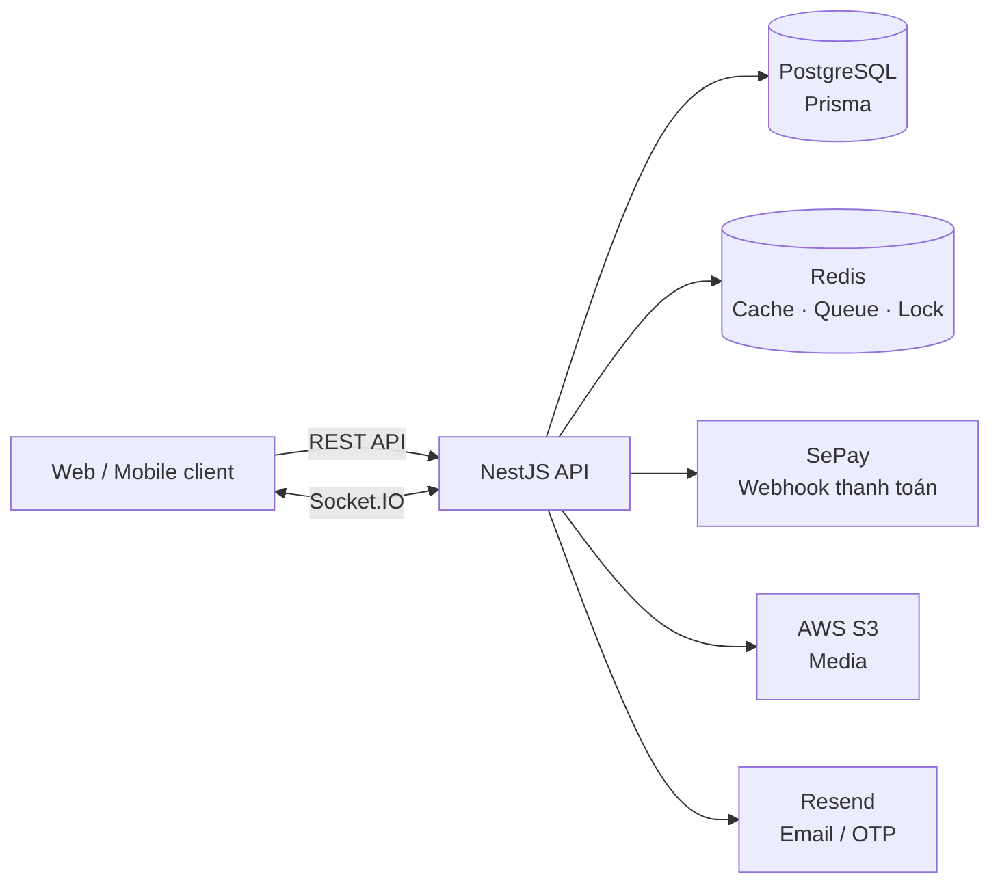

# E-commerce Backend API

Backend API cho một nền tảng thương mại điện tử, xây dựng bằng NestJS và TypeScript. Dự án tập trung vào các luồng thực tế của một hệ thống bán hàng: quản lý catalog, giỏ hàng, đặt hàng, thanh toán chuyển khoản và phân quyền quản trị.

## Điểm nổi bật

- Xác thực JWT với access token/refresh token theo thiết bị, 2FA TOTP và Google OAuth.
- Phân quyền RBAC theo role, permission, HTTP method và API path.
- Quản lý sản phẩm, SKU, thương hiệu, danh mục, giỏ hàng, đơn hàng và đánh giá; hỗ trợ tiếng Việt/Anh.
- Thanh toán chuyển khoản qua VietQR và webhook SePay; cập nhật trạng thái thanh toán theo thời gian thực bằng Socket.IO.
- Xử lý đồng thời khi đặt hàng bằng Redis Redlock để giảm nguy cơ bán vượt tồn kho.
- Upload media lên AWS S3, gửi email OTP qua Resend và xử lý tác vụ nền bằng BullMQ.

## Kiến trúc ở một cái nhìn

## Nhóm chức năng

| Nhóm       | Chức năng                                                                |
| ---------- | ------------------------------------------------------------------------ |
| Tài khoản  | Đăng ký/đăng nhập, Google OAuth, 2FA, quản lý phiên thiết bị và hồ sơ.   |
| Quản trị   | Quản lý user, role, permission và ngôn ngữ.                              |
| Catalog    | Thương hiệu, danh mục đa cấp, sản phẩm, SKU và bản dịch.                 |
| Mua hàng   | Giỏ hàng, tạo đơn, giữ/cập nhật tồn kho, hủy thanh toán quá hạn.         |
| Thanh toán | VietQR, SePay webhook, đối soát giao dịch và thông báo payment realtime. |
| Nội dung   | Đánh giá sản phẩm, media và chat realtime.                               |

## Công nghệ chính

NestJS 11 · TypeScript · PostgreSQL · Prisma ORM · Redis · BullMQ · Socket.IO · Zod · Swagger/OpenAPI · AWS S3 · SePay · Resend · Jest (Unit Testing)

## Chất lượng và vận hành

- DTO được validate và serialize bằng Zod; API có Swagger tại `/api-docs`.
- Helmet, rate limiting và guard bảo vệ API; log HTTP bằng Pino với cơ chế che dữ liệu nhạy cảm.
- Unit test với Jest; ESLint và Prettier giúp duy trì chất lượng mã nguồn.

Xem chi tiết tại [Tech-Stack.md](Tech-Stack.md) và [Project-Structure.md](Project-Structure.md).
