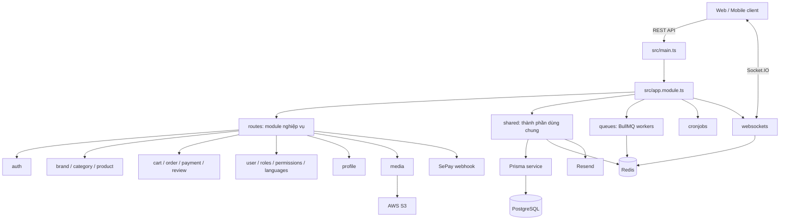
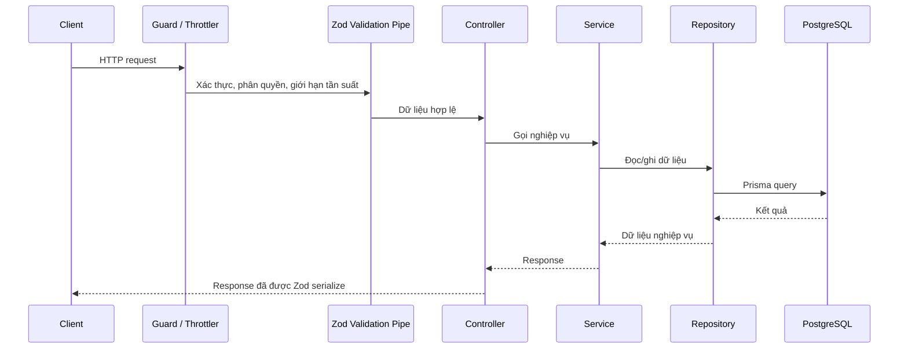

# Cấu trúc dự án

## Tổng quan

Dự án được tổ chức theo kiến trúc module của NestJS. Mỗi miền nghiệp vụ nằm trong `src/routes`, tách riêng controller, service, repository, DTO, schema/model và module. Các thành phần tái sử dụng toàn hệ thống được đặt trong `src/shared`.

## Sơ đồ kiến trúc



## Cây thư mục

```text
ecom/
├── docs/                         # Tài liệu kỹ thuật và vận hành
│   ├── ProjectStructure.md        # Tài liệu này
│   ├── TechStack.md               # Công nghệ sử dụng
│   ├── AWS-Config-Instruction.md  # Hướng dẫn cấu hình AWS S3
│   ├── redlock.md                 # Tài liệu distributed lock
│   └── giai-phap-cho-race-condition.md
├── emails/                        # React Email template và cấu hình email
├── initialScript/                 # Script khởi tạo dữ liệu (seed permissions, ...)
├── prisma/
│   ├── schema.prisma              # Schema PostgreSQL và Prisma Client generator
│   └── migrations/                # Lịch sử migration cơ sở dữ liệu
├── src/
│   ├── main.ts                    # Bootstrap app, Swagger, CORS, Helmet, WebSocket adapter
│   ├── app.module.ts              # Module gốc và cấu hình global
│   ├── cronjobs/                  # Tác vụ chạy theo lịch
│   ├── generated/                 # Mã sinh tự động: Prisma Client và i18n types
│   ├── i18n/                      # Bản dịch en/vi
│   ├── queues/                    # BullMQ consumer và kiểu dữ liệu job
│   ├── routes/                    # Các module nghiệp vụ REST API
│   ├── shared/                    # Thành phần dùng chung toàn ứng dụng
│   └── websockets/                # Gateway chat/payment và Redis Socket.IO adapter
├── test/                          # E2E test và cấu hình Jest
├── upload/                        # File upload cục bộ (nếu có)
├── .env                           # Biến môi trường (không commit secret)
├── package.json                   # Dependencies và npm scripts
├── prisma.config.ts               # Cấu hình Prisma CLI
├── nest-cli.json                  # Cấu hình Nest CLI
├── eslint.config.mjs              # Cấu hình ESLint
├── tsconfig.json                  # Cấu hình TypeScript
└── README.md                      # Hướng dẫn khởi chạy dự án
```

## Chi tiết `src/routes`

Mỗi module nghiệp vụ thường có cấu trúc sau:

```text
<feature>/
├── <feature>.module.ts        # Khai báo module và dependency
├── <feature>.controller.ts    # Khai báo HTTP endpoint
├── <feature>.service.ts       # Điều phối nghiệp vụ
├── <feature>.repo.ts          # Truy cập dữ liệu qua Prisma
├── <feature>.dto.ts           # DTO được tạo từ Zod schema
├── <feature>.model.ts         # Zod schema, kiểu dữ liệu và response model
└── <feature>.error.ts         # HTTP exception theo miền nghiệp vụ (khi cần)
```

| Nhóm | Module | Trách nhiệm |
| --- | --- | --- |
| Xác thực | `auth` | Đăng ký, đăng nhập, JWT/refresh token, 2FA và Google OAuth. |
| Người dùng và quản trị | `profile`, `user`, `roles`, `permissions`, `languages` | Hồ sơ cá nhân, người dùng, RBAC và ngôn ngữ. |
| Danh mục sản phẩm | `brand`, `category`, `product` và các module `*-translation` | Quản lý thương hiệu, danh mục, sản phẩm/SKU và dữ liệu đa ngôn ngữ. |
| Mua hàng | `cart`, `order`, `review` | Giỏ hàng, đặt hàng, tồn kho, đánh giá và media đánh giá. |
| Thanh toán | `payment` | Tạo và theo dõi payment; nhận webhook từ SePay, đối soát giao dịch và phát sự kiện thời gian thực. |
| Media | `media` | Upload, truy xuất và quản lý file qua AWS S3. |

## Chi tiết `src/shared`

```text
shared/
├── config.ts                    # Đọc và validate biến môi trường
├── constants/                   # Hằng số cho auth, order, payment, queue, role, media
├── decorators/                  # Decorator xác thực, phân quyền và serialization
├── dtos/                        # DTO dùng chung cho request/response
├── filters/                     # Global exception filters
├── guards/                      # JWT, authorization, payment API key và rate limiting
├── interceptor/                 # Interceptor log và chuyển đổi response
├── models/                      # Zod schema/model dùng chung
├── pipes/                       # Global Zod validation pipe
├── repositories/                # Repository dùng chung giữa nhiều module
├── services/                    # Prisma, JWT, hashing, 2FA, email và S3
├── redis.ts                     # Redis client và Redlock
└── shared.module.ts             # Global module export shared services/guards
```

## Luồng xử lý một request REST



## Quy ước bổ sung

- Không chỉnh sửa trực tiếp `src/generated/`; mã trong thư mục này được sinh từ Prisma và `nestjs-i18n`.
- Khi thêm module mới, giữ cấu trúc `module → controller → service → repository` để nhất quán với các module hiện có.
- Migration database được quản lý trong `prisma/migrations`; thay đổi model cần cập nhật `prisma/schema.prisma` và sinh lại Prisma Client.
- Thông tin nhạy cảm chỉ đặt trong `.env`; không đưa API key, JWT secret hoặc S3 credential vào mã nguồn/tài liệu.
